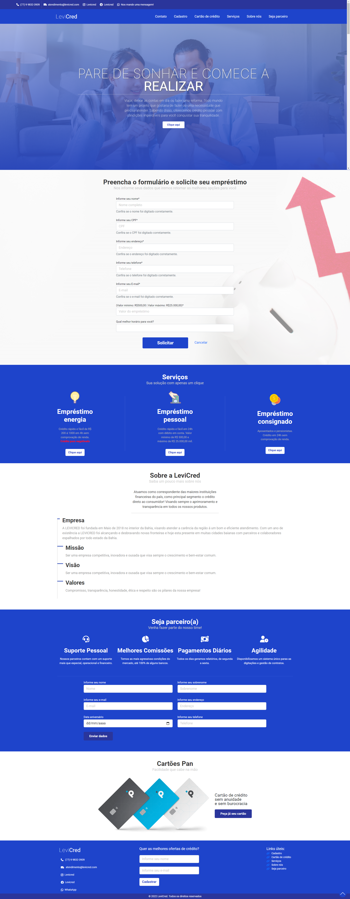
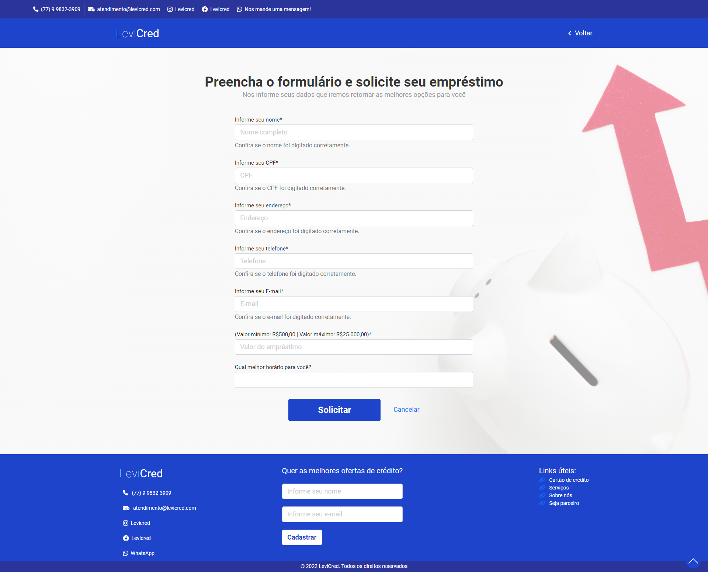

# LeviCred

Landpage desenvolvida para coletar dados de clientes via formulários.

## 🚀 Começando

Para visualizar o projeto basta acessar aqui: https://eumarcel0.github.io/site-emprestimo/

### 🎥 Usabilidade e funcionalidades

Os clientes preencherão os formulários com os seus dados e enviar diretamente para o admin da empresa. Todo processo de envio será feito pelo back-end.

## 🛠️ Construído com

Todo o projeto foi construído utilizando:

* [HTML5](https://developer.mozilla.org/pt-BR/docs/Web/HTML) - Toda marcação da aplicação.
* [CSS3](https://developer.mozilla.org/pt-BR/docs/Web/CSS) - Toda a estilização da aplicação.
* [Bootstrap](https://getbootstrap.com/docs/5.2/getting-started/introduction/) - Biblioteca para pegar componentes e container.
* [JavaScript](https://developer.mozilla.org/pt-BR/docs/Web/JavaScript) - Toda parte de programação/lógica do front-end.
* [Font Awesone](https://fontawesome.com/docs) - Todos os icones utilizados.

## 📌 Versão

Todo controle de versão foi realizado dentro do repositório do GitHub.

## ✒️ Autores

* **Marcelo Silva** - *Todo front-end da aplicação* - [/EuMarcel0](https://github.com/EuMarcel0)
* **Uilquer Dourado** - *Todo back-end da aplicação* - [/DouradoUilquer](https://github.com/DouradoUilquer)

## 📄 Licença

Open Source.

## 🎁 Expressões de gratidão

Fico muito grato por ter concluído este projeto, pois foi o segundo trabalho real para um cliente real.
Graças à Deus deu tudo certo.
💻🚀😊😊
